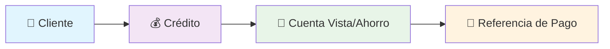
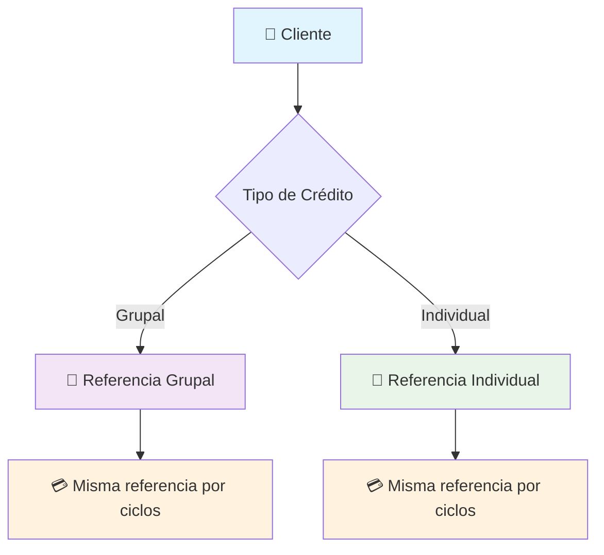

# 💳 Sistema de Referencias de Pago para Créditos

## 📋 Resumen Ejecutivo

Este documento define la arquitectura y procesos para la generación de referencias de pago de créditos, optimizando la experiencia del cliente y simplificando la gestión de pagos tanto grupales como individuales.

---

## 🏗️ Arquitectura Actual del Sistema

### 🔗 Relación Crédito-Cuenta

Cuando se origina un crédito en el Core Bancario, automáticamente se establece la siguiente estructura:

**Características clave:**

- 🔄 **Persistencia**: La cuenta se crea una sola vez y persiste a través de renovaciones
- 🆔 **Estabilidad**: El ID de la cuenta se mantiene constante aunque el folio del crédito cambie
- 📊 **Escalabilidad**: Soporta múltiples créditos simultáneos del mismo cliente

---

## 🏛️ Marco Regulatorio

### 📋 Definiciones BANXICO

| Concepto         | Definición                                            | Regulación   |
| ---------------- | ----------------------------------------------------- | ------------ |
| **CLABE**        | Clave Bancaria Estandarizada (18 dígitos)             | BANXICO/SPEI |
| **BIN TDC**      | Bank Identification Number para Tarjetas (16 dígitos) | Carnet       |
| **Cuenta Única** | Una CLABE por instrumento financiero                  | Obligatorio  |

### ⚖️ Restricciones Regulatorias

> ⚠️ **Limitación Crítica**: No se pueden crear cuentas CLABE consolidadas por grupo debido a regulaciones de BANXICO.
>
> 💡 **Oportunidad**: Es técnicamente viable crear CLABEs grupales, pero requiere aprobación de Cumplimiento y Legal.

---

## 🚀 Canales de Pago Disponibles

### 📊 Matriz de Canales

| Canal                          | Método              | Aplicación          | Tiempo | Estado    |
| ------------------------------ | ------------------- | ------------------- | ------ | --------- |
| 🏦 **SPEI CLABE Crédito**      | Directo a CLABE     | En línea            | T+0    | ✅ Activo |
| 🏦 **SPEI CLABE Cuenta Vista** | Via cuenta puente   | Cobranza automática | T+0    | ✅ Activo |
| 💳 **SPEI BIN TDC**            | Referencia Carnet   | Diferido            | T+0    | ✅ Activo |
| 💵 **Efectivo en Bancos**      | BIN TDC Carnet      | Prosa               | T+1    | ✅ Activo |
| 🌐 **Banca Electrónica**       | BIN Carnet          | Prosa               | T+1    | ✅ Activo |
| 🏪 **Depósito Referenciado**   | Convenios bancarios | Diferido            | T+1    | ✅ Activo |

---

## 🎯 Objetivo Estratégico

### 🔑 Visión del Producto

> **"Una referencia, múltiples ciclos"**
>
> Proporcionar al cliente una experiencia simplificada donde mantenga la misma referencia de pago a través de todas las renovaciones de crédito.

### 📈 Beneficios Esperados

- 🎯 **Experiencia de Usuario**: Eliminación de confusión por cambios de referencia
- ⚡ **Eficiencia Operativa**: Reducción de errores de aplicación de pagos
- 💰 **Reducción de Costos**: Menor soporte al cliente por referencias incorrectas
- 📊 **Mejor Tracking**: Historial consolidado de pagos por cliente

---

## 🚧 Retos Técnicos y Soluciones

### 🎯 Estrategia de Referencias

### 🔄 Gestión de Múltiples Créditos

#### Escenario 1: Un Crédito Vigente

- ✅ **Solución Simple**: Aplicación automática al único crédito activo
- 🎯 **Estrategia**: Forzar finiquito antes de nueva originación

#### Escenario 2: Múltiples Créditos Vigentes

- 🤝 **App CrediClub**: Cliente selecciona crédito destino
- 🏦 **SPEI Automático**: Aplicar criterios de prelación

#### Escenario 3: Pago Excedente

- 💰 **Retención**: Mantener en cuenta vista
- 📱 **Notificación**: Alertar al cliente via app para distribución manual

---

## 📋 Plan de Implementación

### 🎯 Fase 1: Preparación

- [ ] Validación legal y cumplimiento para CLABEs grupales
- [ ] Desarrollo de motor de prelación de pagos
- [ ] Actualización de sistema de notificaciones

### 🎯 Fase 2: Desarrollo

- [ ] Implementación de referencias persistentes
- [ ] Integración con canales de pago existentes
- [ ] Testing de escenarios múltiples créditos

### 🎯 Fase 3: Despliegue

- [ ] Migración gradual de clientes existentes
- [ ] Monitoreo de aplicación de pagos
- [ ] Optimización basada en comportamiento real

---

## 📊 Métricas de Éxito

| KPI                         | Objetivo | Medición                |
| --------------------------- | -------- | ----------------------- |
| 📉 **Reducción Errores**    | -80%     | Pagos mal aplicados/mes |
| ⚡ **Tiempo Resolución**    | -60%     | Tiempo promedio soporte |
| 😊 **Satisfacción Cliente** | >90%     | NPS proceso de pago     |
| 💰 **Eficiencia Operativa** | +50%     | Automatización de pagos |

---

_Documento preparado para revisión de Product Owners_
_Última actualización: Octubre 2025_
