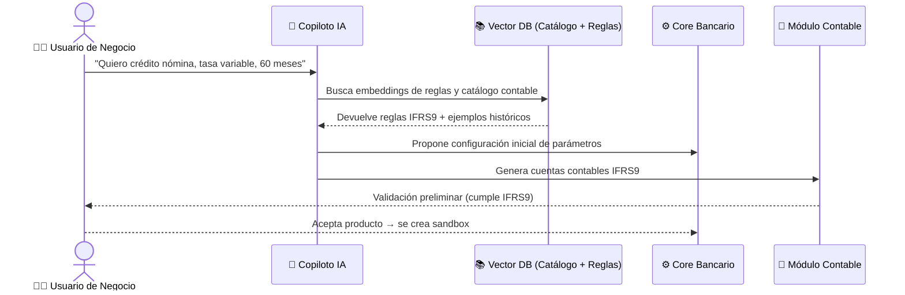

# 🏦 Arquitectura Técnica – IA en Core Bancario

Este documento describe la arquitectura técnica propuesta para integrar un **copiloto de IA** en el core bancario,
enfocado en la **creación y parametrización de productos de crédito** con cumplimiento IFRS9.

---

## 🏗️ 1. Arquitectura Técnica (PlantUML – C4 Context)

```plantuml
@startuml
title 🌐 Arquitectura Técnica - IA para Core Bancario

!define RECTANGLE class
!theme plain

actor "👩‍💼 Usuario de Negocio\n(Product Manager, Crédito)" as User
actor "👨‍💻 Equipo Contabilidad" as Contabilidad
actor "👮 Regulador\n(CNBV / IFRS9)" as Regulador

RECTANGLE CoreBancario {
  [Módulo de Configuración de Productos] as ModProd
  [Módulo Contable\n(Catálogo IFRS9)] as ModContab
  [Motor de Integración APIs] as API
}

RECTANGLE IA {
  [Copiloto IA\n(OpenAI GPT-4/5 API)] as Copiloto
  [Vector DB\n(Pinecone / Weaviate)] as Pinecone
  [ML Models\n(Scikit, TensorFlow, PyTorch)] as ML
}

User --> Copiloto : Describe producto en lenguaje natural
Copiloto --> Pinecone : Busca embeddings / reglas contables
Copiloto --> ML : Sugerencias paramétricas (tasas, riesgo)
Copiloto --> ModProd : Genera sandbox de producto
Copiloto --> ModContab : Propone catálogo contable IFRS9
Contabilidad --> ModContab : Valida cuentas y provisiones
ModContab --> Regulador : Reportes normativos
@enduml
```

---

## 🔄 2. Flujo del Copiloto de Productos (Mermaid Sequence)



---

## ⚡ 3. Componentes Técnicos

- **Front-end / UI**:  
  - React/Angular (interfaz de copiloto para negocio).  

- **Backend Core**:  
  - Node.js / Spring Boot (exposición de APIs).  
  - PostgreSQL/MongoDB (catálogo contable, parametrizaciones).  

- **IA / NLP**:  
  - OpenAI GPT-4/5 (razonamiento en lenguaje natural).  
  - LangChain (orquestación).  
  - Pinecone/Weaviate (vector store de reglas IFRS9 + catálogo contable).  

- **Machine Learning**:  
  - Scikit-learn (prototipos).  
  - TensorFlow/PyTorch (modelos productivos).  
  - MLflow (gestión de experimentos).  

- **Integraciones**:  
  - APIs core bancario para crear productos en sandbox.  
  - APIs contables para registrar catálogo.  
  - Conexión con DataLake/ETL para entrenamiento ML.  

---

📌 Con esta arquitectura, el core bancario evoluciona a un **core aumentado por IA**,  
donde negocio, contabilidad y regulador trabajan con mayor velocidad, cumplimiento y escalabilidad.
